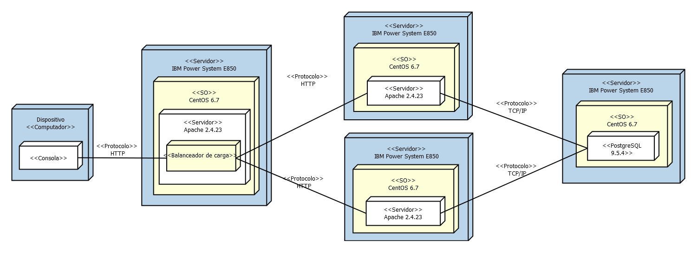
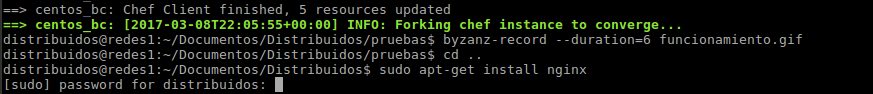
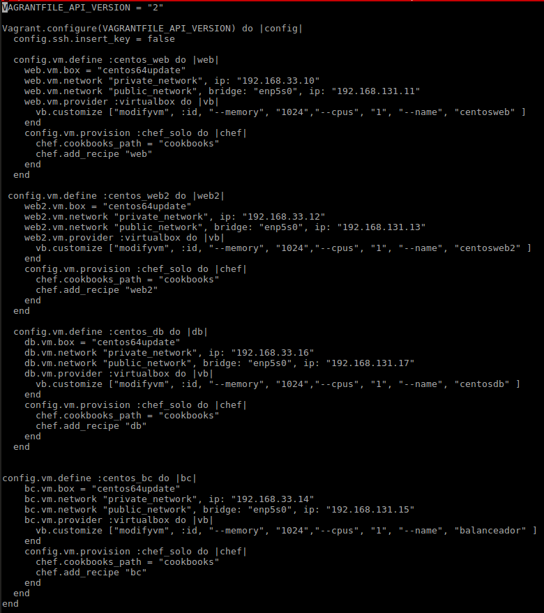
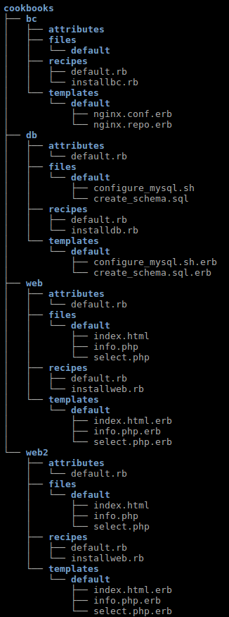
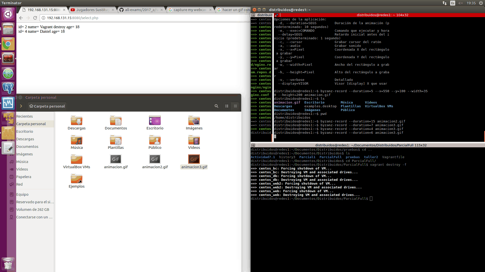
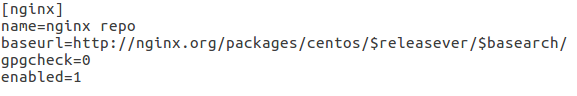

# Balanceador-de-carga-con-nginx
Autor:

**Estudiante: Jorge Arturo Hernández Muñoz

**Código: A00317220

El reto de este ejercicio era hacer un balanceador de carga que tuviera la siguiente arquitectura

habían distintas formas de implementarse como por ejemplo apache,
nginx etc. Yo use gnix así que para empezar tuve que instalar gnix. Prueba de instalación de gnix:

Una vez hecho esto lo que se hizo fue que de manera automática, se conectara con las webs y que estas se conectarán a la 
base de datos, para así poder balancear.

Vagrantfile:
A continuación  se muestra la configuración del vagrantfile.
(Este archivo esta disponible en este repositorio)
Aquí se ve la configuración de :

web1.
web2.
Base de datos (db).
balanceador (bl).

esta configuración incluye la ip pública, ip privada, las interfaces, la box que está usando, el nombre que se le va a dar 
a la máquina, los cookbooks y los récipes con que debe configurarse.

A continuación se muestran como se configuraron los cookbooks (Los cookbooks estan dsponibles en este repositorio)

finalmente una prueba de funcionamiento:

Documentación de problemas.

Para esta actividad solo tuve un problema el cual fue que cuando se instaló gnix este venia con una url por defecto,
url que descargaba un repositorio con lo que hacía falta para realizar el balanceador. esta url no servía así que 
lo que se hizo fue entrar al archivo de configuración y cambiar la url del repositorio así cuando se hiciera el 
aprovisionamiento instalará los paquetes correctos.

Conclusión 
La realización de este ejercicio fue importante porque va ligado con la arquitectura de software ya que un balanceador de carga mapea con algunos atributos de calidad como lo son el rendimiento y la disponibilidad, cosa que como ingeniero de sistemas tengo que asegurar en todas las implementaciones que haga. 

## Todos los archivos estan disponibles en este repositorio.
